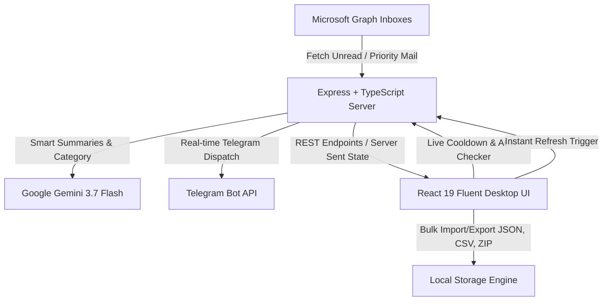

<div align="center">

# 📬 WinMail Fleet Controller & Telegram Sentinel

<p align="center">
  <strong>Next-Generation Multi-Account Microsoft Graph Inboxes Sentinel & Instant Telegram Dispatcher</strong>
</p>

<p align="center">
  
  
  
  
  
  
  
  
</p>

<p align="center">
  A high-performance Windows 11 Fluent UI desktop dashboard designed to monitor unlimited Microsoft Outlook & Hotmail accounts simultaneously, detect incoming emails, extract 2FA/OTP verification codes instantly, and broadcast real-time alerts to Telegram bots with AI-powered summaries.
</p>

---

</div>

<br/>

## 🌟 Key Highlights

<table>
  <tr>
    <td width="50%">
      <h3>⚡ Multi-Account Fleet Sync</h3>
      <p>Monitor dozens of Outlook, Hotmail, and Office 365 inboxes concurrently via Microsoft Graph REST API with automated token renewal.</p>
    </td>
    <td width="50%">
      <h3>🤖 Telegram Bot Sentinel</h3>
      <p>Instant push notifications to custom Telegram channels or direct messages with HTML templates, OTP badges, and action buttons.</p>
    </td>
  </tr>
  <tr>
    <td width="50%">
      <h3>🧠 Gemini 3.7 Flash AI Intelligence</h3>
      <p>Automated email classification, urgent action item extraction, security risk auditing, and smart reply generator powered by Google Gemini.</p>
    </td>
    <td width="50%">
      <h3>🔑 Smart OTP & 2FA Extractor</h3>
      <p>Automatic regex and AI detection of verification codes, PINs, and security tokens with instant one-click copy to clipboard.</p>
    </td>
  </tr>
  <tr>
    <td width="50%">
      <h3>⏱️ Live Cooldown Engine</h3>
      <p>Visual running countdown timer with quick preset dropdown (<code>5s</code>, <code>10s</code>, <code>15s</code>, <code>30s</code>, <code>60s</code>, <code>120s</code>, <code>300s</code>) and instant <strong>Push/Pause</strong> controls.</p>
    </td>
    <td width="50%">
      <h3>🪟 Windows 11 Fluent Experience</h3>
      <p>Mica-glass aesthetics, dynamic dark/light themes, density scaling (Compact, Ultra, Normal), toast notifications, and interactive audio feedback.</p>
    </td>
  </tr>
</table>

<br/>

---

## 📸 Architecture & Workflow



<br/>

---

## 🚀 Quick Start Guide

### Prerequisites

Ensure you have the following installed on your machine:
- **Node.js**: `v18.0.0` or higher (Node 20+ recommended)
- **Package Manager**: `npm`, `pnpm`, `bun`, or `yarn`

### 1. Clone the Repository

```bash
git clone https://github.com/your-username/winmail-telegram-controller.git
cd winmail-telegram-controller
```

### 2. Install Dependencies

```bash
npm install
# or with bun
bun install
```

### 3. Environment Variables Configuration

Create a `.env` file in the root directory:

```env
# Optional: Google Gemini API Key for smart summaries and reply drafts
GEMINI_API_KEY="your_gemini_api_key_here"

# Optional: Default Telegram Bot Token & Chat ID
TELEGRAM_BOT_TOKEN="your_telegram_bot_token"
TELEGRAM_CHAT_ID="your_telegram_chat_id"

# Application URL
APP_URL="http://localhost:3000"
```

> **Note:** All tokens, credentials, and settings can also be safely configured and saved directly inside the app UI via the **Settings** view.

### 4. Run Development Server

```bash
npm run dev
```

Visit **`http://localhost:3000`** in your browser.

### 5. Build for Production

```bash
npm run build
npm run start
```

<br/>

---

## 🎛️ Header Controls & Navigation

| Control | Action | Description |
| :--- | :---: | :--- |
| **🔄 Refresh** | Click | Triggers an immediate, instant mail check across all connected inboxes. |
| **⏸️ Push / ▶️ Paused** | Click | Toggles background auto-checking. When pushed, auto-checking stops immediately. |
| **⏱️ Cooldown Counter** | Display | Displays the active countdown (e.g. `24s / 30s`) with live pulse animations. |
| **⌄ Cooldown Dropdown** | Menu | Select preset intervals (`5s Turbo` to `10m`) or enter custom seconds. |
| **🌙 Dark / Light** | Toggle | Seamlessly switches between Windows 11 Dark Mode and Light Mica theme. |
| **🎚️ Density Switcher** | Toggle | Cycles through `Normal`, `Compact`, and `Ultra-dense` data views. |

<br/>

---

## 🛠️ Feature Breakdown

### 1. Multi-Account Management (`/accounts`)
- Add unlimited Microsoft Graph accounts with `Client ID`, `Refresh Token`, and optional `Client Secret`.
- Support for personal accounts (`/consumers`) and organizational tenants (`/common`).
- Real-time token health verification and token auto-refresh lifecycle.
- Bulk batch import & export via JSON and CSV.

### 2. Live Inbox Explorer (`/inbox`)
- Filter by unread, flagged, high-importance, or specific sender domain.
- Search messages across subjects, bodies, and sender addresses.
- Auto-extracts OTP verification codes and 2FA tokens into one-click copy tags.
- Full HTML & sanitized plain-text preview with complete header metadata.

### 3. Telegram Bot Dispatcher (`/telegram`)
- Configure multiple alert channels or direct chats.
- Customizable alert templates with parameters:
  - `{sender}`, `{subject}`, `{time}`, `{code}`, `{account}`, `{preview}`
- Test Telegram connection button (`getMe` API check) with instant test dispatch.
- Filter alerts to only forward verification codes, urgent mail, or all emails.

### 4. AI Email Intelligence (`/ai`)
- **Executive Summaries**: 1-2 sentence TL;DR of complex threads.
- **Smart Reply Drafts**: Professional, contextual responses ready to copy.
- **Action Item Extraction**: Identifies deadlines, tasks, and follow-ups.
- **Security Audit**: Scans for phishing indicators, spoofed domains, and credential warnings.

### 5. Fleet Exporter (`/exporter`)
- Export account lists, message logs, and extracted verification codes.
- Supports **JSON format**, **CSV spreadsheets**, and compressed **ZIP archives**.

<br/>

---

## 🔌 API Reference

The built-in Express server provides secure proxy endpoints to prevent client-side credential exposure:

```
GET  /api/health             - System health, environment, and token availability
POST /api/microsoft/token    - Exchange refresh token for fresh Graph access token
POST /api/microsoft/inbox    - Fetch latest messages and filtered search results
POST /api/microsoft/message  - Fetch comprehensive message details & raw content
POST /api/telegram/test      - Validate bot token via Telegram getMe
POST /api/telegram/send      - Dispatch HTML-formatted message with action buttons
POST /api/ai/summarize       - Perform Gemini 3.7 Flash analysis and summary
```

<br/>

---

## 🎨 Tech Stack

- **Frontend**: React 19, Motion (Framer Motion animations), Lucide Icons, Tailwind CSS v4
- **Backend Server**: Express.js with TypeScript and Vite middleware
- **AI Engine**: Google Gemini API (`@google/genai` with `gemini-3.7-flash`)
- **Mail Protocol**: Microsoft Graph REST API v1.0
- **Bot Protocol**: Telegram Bot HTTP API
- **Archive Engine**: JSZip

<br/>

---

## 📄 License

This project is licensed under the **MIT License**. Feel free to use, modify, and distribute for personal and commercial projects.

<div align="center">
  <sub>Built with precision using Windows 11 Fluent Design principles and Google Gemini AI.</sub>
</div>
